# Project Planning Easy Rental
Welcome to Easy Rentals – Your Trusted Tool Rental Platform

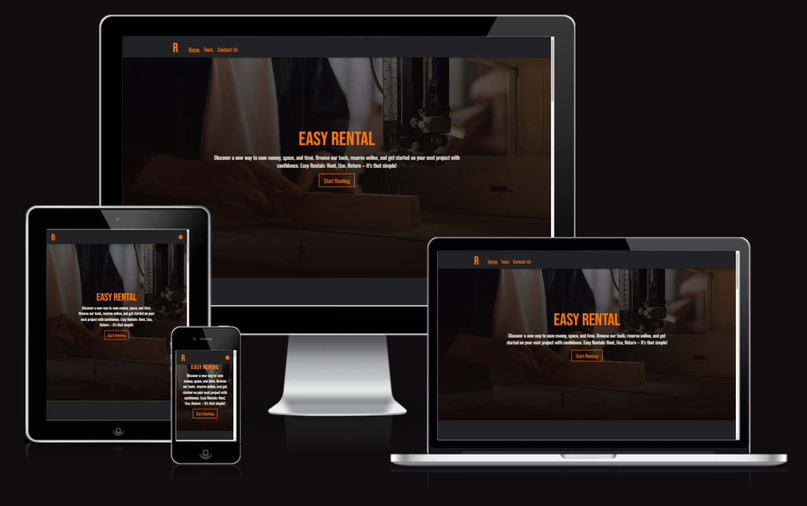

Visit the deployed site: [Easy Rental](https://hourianouhkhanjar.github.io/easy-rental/)

## Project Description

At Easy Rentals, we make it easy for you to access the tools when you need them. Whether you're a homeowner tackling weekend projects, or a professional contractor, our platform connects you with a wide selection of high-quality tools available for rent. Forget about expensive purchases or cluttered storage – with us, you only pay for what you use.

Discover a new way to save money, space, and time. Browse our tools, reserve online, and get started on your next project with confidence. Easy Rentals: Rent, Use, Return – It’s that simple!

- - -

## CONTENTS

* [User Experience](#user-experience-ux)
  * [User Goal](#user-goal)
  * [User Stories](#user-stories)

* [Design](#design)
  * [Colour Scheme](#colour-scheme)
  * [Typography](#typography)
  * [Imagery](#imagery)
  * [Wireframes](#wireframes)
  * [Features](#features)
    * [Home Page](#home-page)
    * [Booking Page](#booking-page)
    * [Contact Supplier Page](#contact-supplier-page)
    * [Response Page](#response-page)

* [Technologies Used](#technologies-used)
  * [Languages Used](#languages-used)
  * [Frameworks, Libraries & Programs Used](#frameworks-libraries--programs-used)

* [Deployment & Local Development](#deployment--local-development)
  * [Deployment](#deployment)
  * [Local Development](#local-development)
    * [How to Fork](#how-to-fork)
    * [How to Clone](#how-to-clone)

* [Testing](#testing)

* [Credits](#credits)
  * [Code Used](#code-used)
  * [Content](#content)
  * [Media](#media)
  * [Acknowledgments](#acknowledgments)

- - - 

## User Experience (UX)

### User Goal

 - The user's main goal is to have easy and affordable access to the tools they need to perform specific tasks, whether for home repairs or professional jobs, without the cost and commitment of ownership.
- Users seek to save money by renting rather than purchasing tools.

### User Stories
1. **Tool Listing:**
   
   Enable user to see a list of tools with title, image, location, category, price, and availability.So the user can find tools based on location, availability, type, and price.

2. **Booking and Reservation:**

   A booking feature that allows users to reserve tools for specific dates.

   
3. **Contact support:**

   When a technical problem occurs, such as a malfunction in the reservation process or in communicating with the supplier.

  
4. **Contact supplier:**

   So users can communicate with the supplier about rentals, pickup, or delivery details.

    
5. **Reviews:**

   Allow users to see reviews of tools and suppliers, fostering trust and transparency within the platform.

- - - 

## Design

### Colour Scheme

Since the site is geared towards renting tools, most of the tools have copper or iron colors or have a black foil part. So I decided to use orange and aqua as the primary colors, in addition to using black for the background, in order to distinguish between the background and the foreground well.

In my css file I have used variables to declare colours. 

* I have used `#ff7800` as the primary color for main actions and headers.
* I have used `#26d9ff` as the secondary color for secondary actions.
* I have used `#222123` as background color for main section.
* I have used `#edefea` & `#fffbf8` as background color for seconday section and plain text.

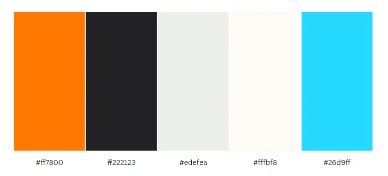

### Typography

Google Fonts was used to import the chosen fonts for use in the site.

* For the Page Title I have used the google font [Bebas Neue](https://fonts.google.com/specimen/Bebas+Neue).

* For the body of the page I have used the google font [Oswald](https://fonts.google.com/specimen/Oswald).

These fonts would provide a strong balance of readability and professionalism on a tool rental website.

### Imagery

Since the website aims to rent electrical, electronic or other tools for maintenance or construction work, I chose pictures of people using tools for different purposes as background images.
This could be as if the user, when visiting the website, is visiting a workshop from which he can boborrow the tools he needs and when he is finished, return them to their place.

### Wireframes

Wireframes were created for mobile, tablet and desktop using balsamiq.

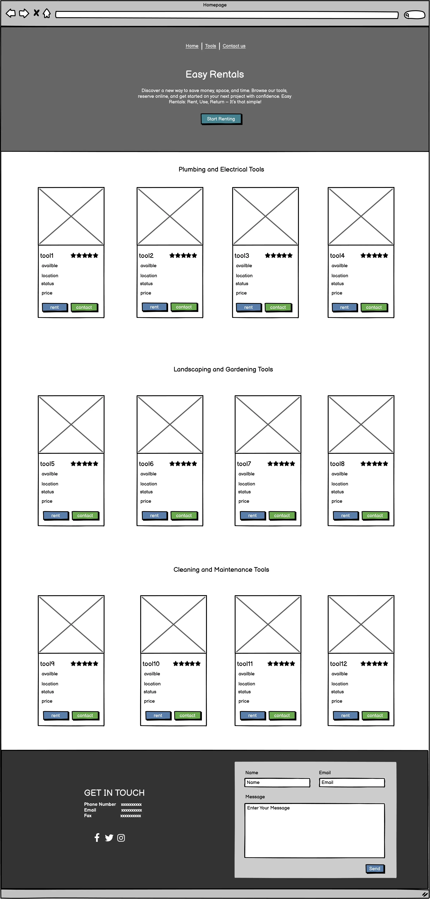
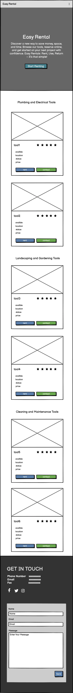
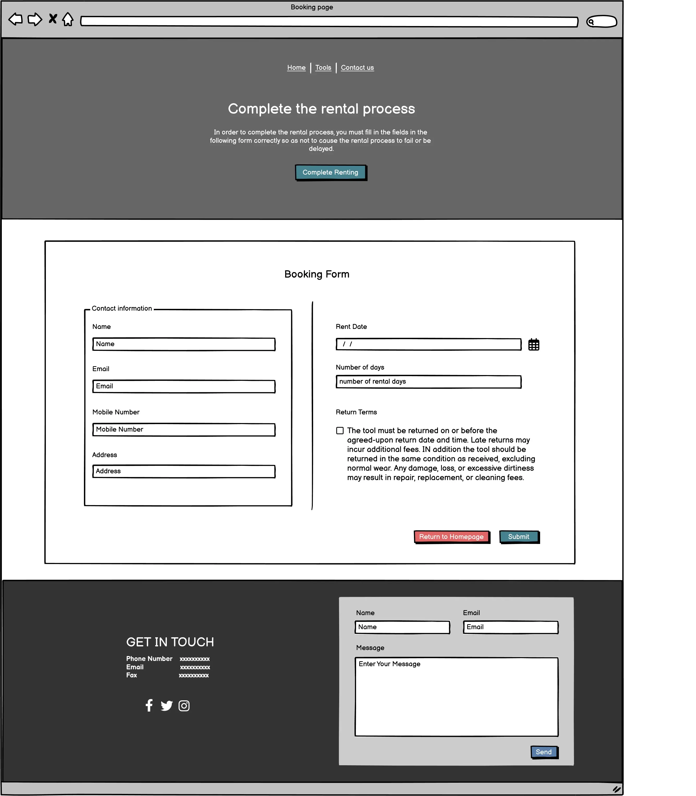
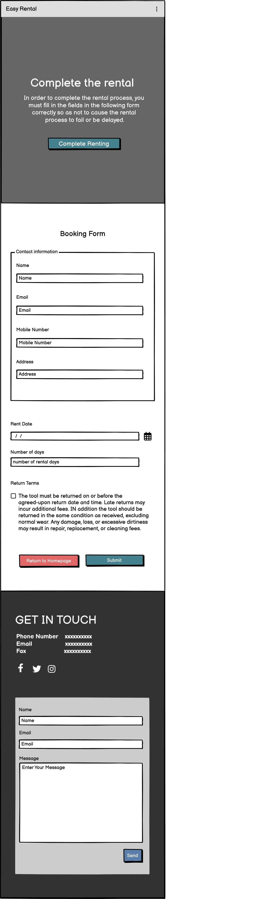
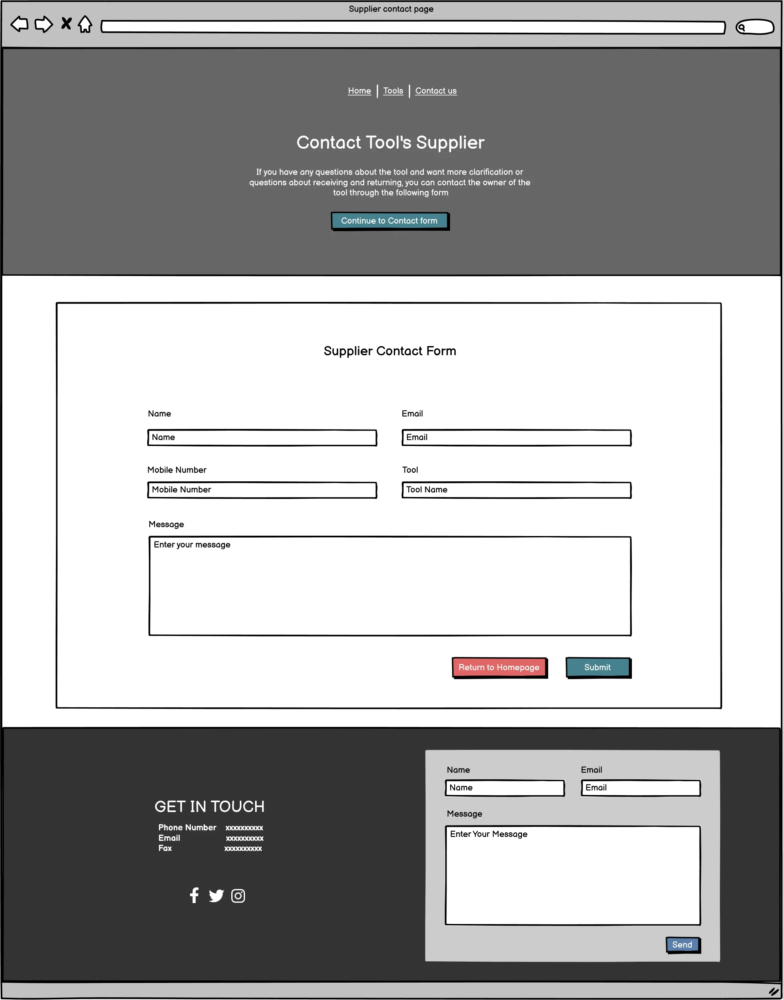
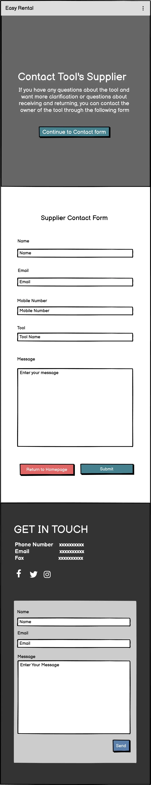

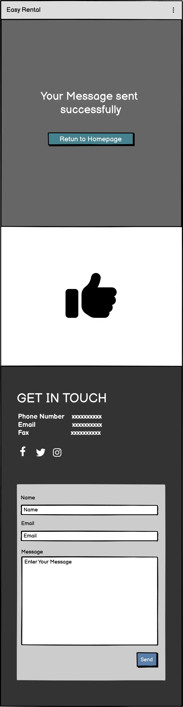

### Features

The website is contains home page, booking page, contact supplier page, response page.

All Pages on the website are responsive.

#### Home Page

The Home page displays the folwing sections:

- **Header section:** A simple definition phrase and a button that when clicked takes the user to the tools list section. 

- **Tools section:** Each tool card contains a title, availability, location, price, and two button, "Rent Now" takes the user to booking page, and  "Contact Supplier" takes the user to contact supplier page. 

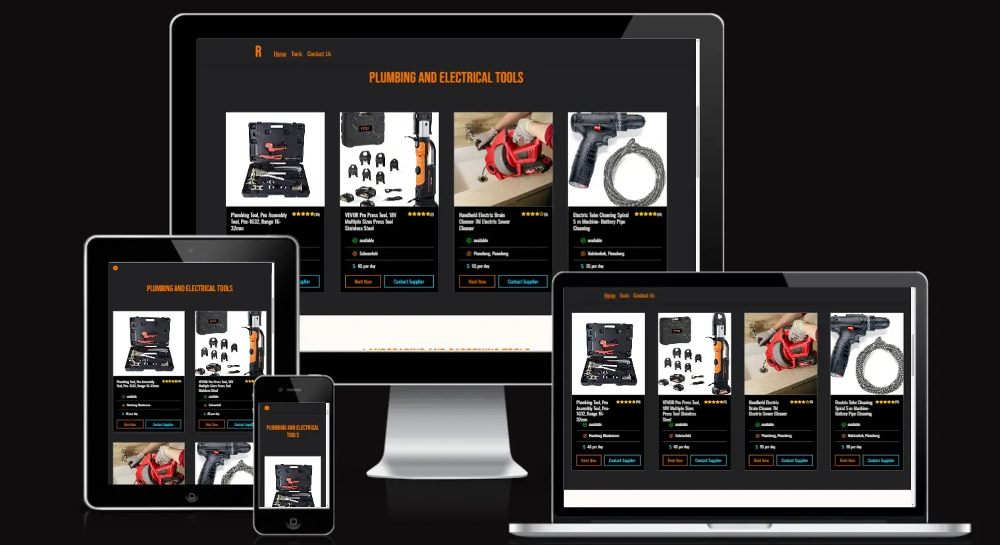

- **Footer section and contact us form:** This section contains contacts information and support contact form.

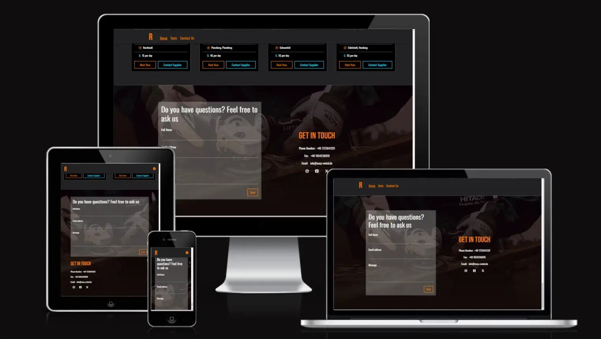

*The validation conditions that apply to the input fields are the required condition, email validation, and that white spaces are not allowed in text fields.*

#### Booking Page

The Booking page displays the folwing sections:

- **Header section:** A continuation confirmation sentence for renting and a button that when clicked takes the user to booking form section. 

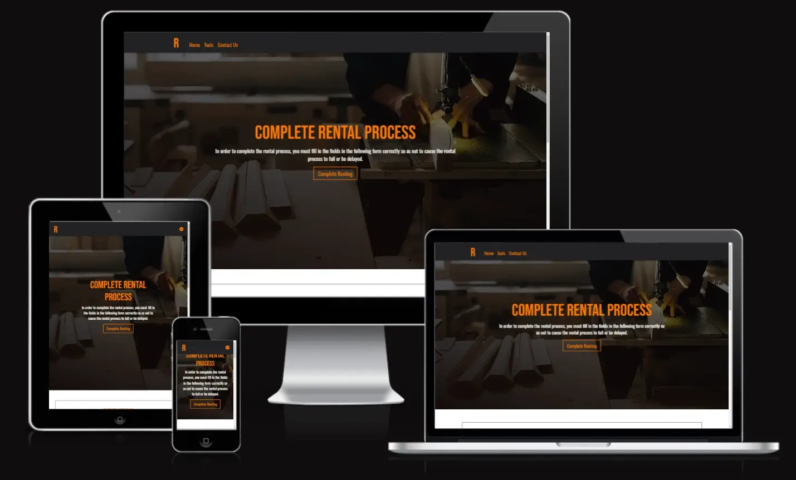

- **Booking form section**: Display a form allows user to enter his personal information in addition to the rental information. 
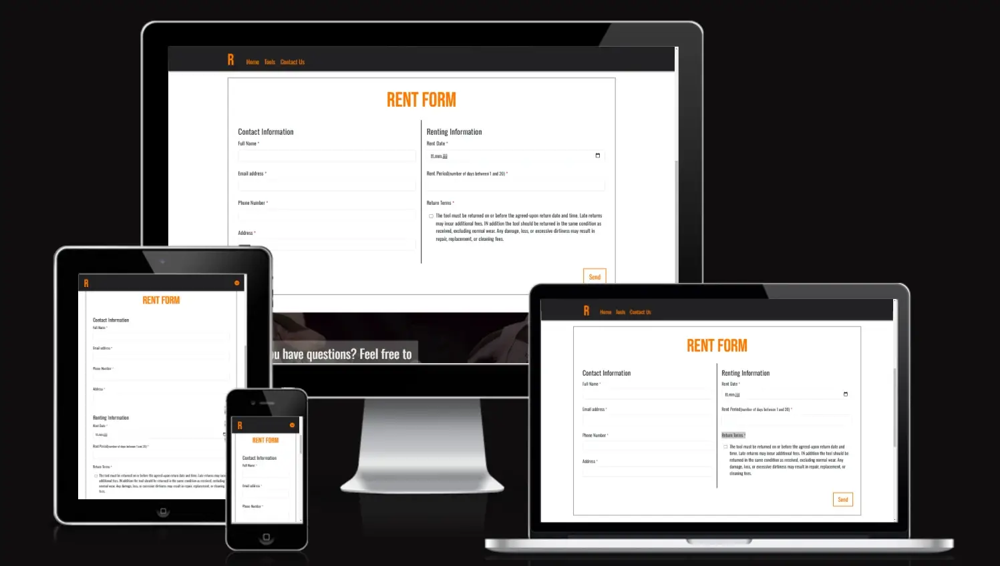

*The validation conditions that apply to the input fields are the required condition, email validation, phonenummber validation, date validation, duration validation and that white spaces are not allowed in text fields.*

#### Contact Supplier Page

The Contact Supplier page displays the folwing sections:

- **Header section:** A continuation confirmation sentence and a button that when clicked takes the user to contact supplier form section. 

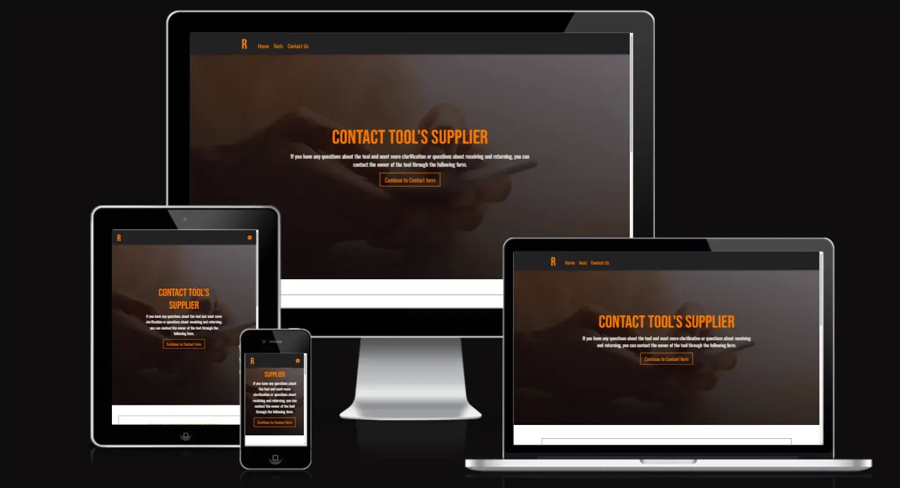

- **Contact supplier form section**: Display a form allows user to enter his personal information, name of tool he will ask about and the question. 
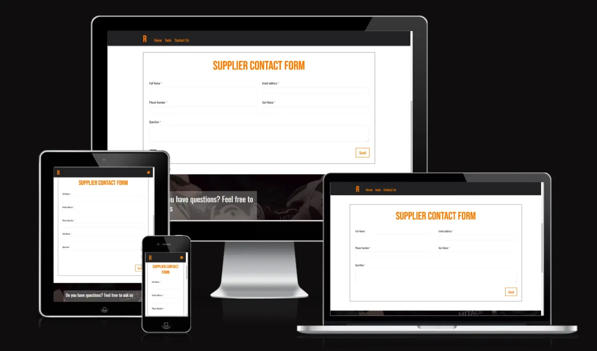

*The validation conditions that apply to the input fields are the required condition, email validation, phonenummber validation and that white spaces are not allowed in text fields.*

#### Response Page

The Response page displays the folwing sections:

- **Header section:** Contains a successful response sentence and a button to return to the home page.

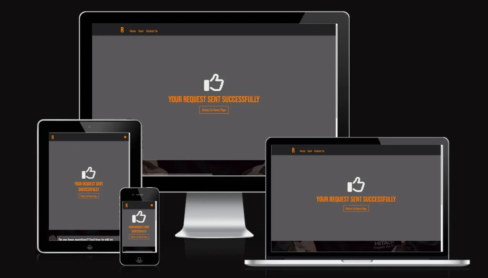

- - -

## Technologies Used

### Languages Used

HTML, CSS, Bootstrap, Javascript

### Frameworks, Libraries & Programs Used

* [Balsamiq](https://balsamiq.com/) - Used to create wireframes.

* [Git](https://git-scm.com/) - For version control.

* [Github](https://github.com/) - To save and store the files for the website.

* [GitPod](https://gitpod.io/) - IDE used to create the site.

* [Google Fonts](https://fonts.google.com/) - To import the fonts used on the website.

* [Google Developer Tools](https://developers.google.com/web/tools) - To troubleshoot and test features, solve issues with responsiveness and styling.

* [TinyPNG](https://tinypng.com/) To compress images

* [Favicon.io](https://favicon.io/) To create favicon.

* [Am I Responsive?](http://ami.responsivedesign.is/) To show the website image on a range of devices.

- - -

## Deployment & Local Development

### Deployment

The site is deployed using GitHub Pages - [Easy Rentals](https://hourianouhkhanjar.github.io/easy-rental/).

### Local Development

#### How to Fork

To fork the repository:

1. Go to the repository [HouriaNouhKhanjar/easy-rental](https://github.com/HouriaNouhKhanjar/easy-rental)
2. Click the Fork button in the top right corner.

#### How to Clone

To clone the repository:

1. Go to the repository [HouriaNouhKhanjar/easy-rental](https://github.com/HouriaNouhKhanjar/easy-rental)
2. Click on the code button, and copy the link shown.
3. Type 'git clone' into the terminal and then paste the link you copied.

- - -

## Testing

Please refer to [TESTING.md](TESTING.md) file for all testing carried out.

- - -

## Credits

### Code Used

* I used [this Stackoverflow code](https://stackoverflow.com/questions/74585566/set-date-input-fields-minimum-date-to-today) To ensure that the rental date does not exceed a date before the current day, this validation rule is applied to the rental date field on the booking form.

* I used [this JS code](https://jsfiddle.net/5ws33c8s/) To apply fade in animation on tool card and header text.

* I used [this Stackoverflow code](https://stackoverflow.com/questions/51504463/fade-animation-while-scrolling) To apply the animation only when scrolling.

* I used [this Stackoverflow code](https://stackoverflow.com/questions/13766015/is-it-possible-to-configure-a-required-field-to-ignore-white-space) To apply whitespace validation on text input.

### Content

All tools information for my site were taken from [Amazon](https://www.amazon.de/).

All other content for the site, such as introduction messages and instructions were written by myself.

### Media

* Background images were taken from [pexels](https://www.pexels.com/).
* Tool sampel images were taken from [pinterest](https://de.pinterest.com/).

### Acknowledgments

I would like to acknowledge the following people:

* Jubril Akolade - My Code Institute Mentor.

* The Code Institute Course that prepared me to complete this project in the best possible way..