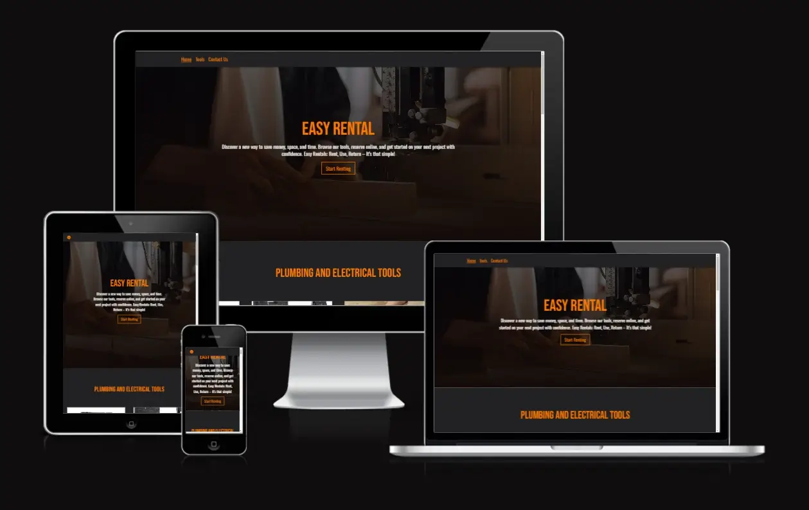
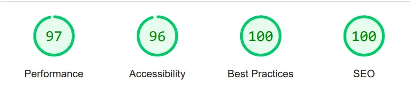
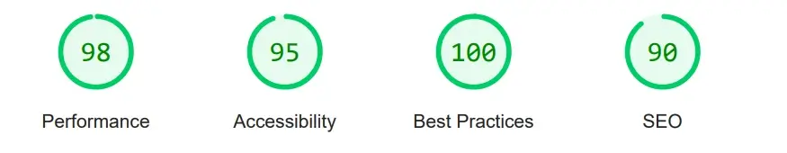
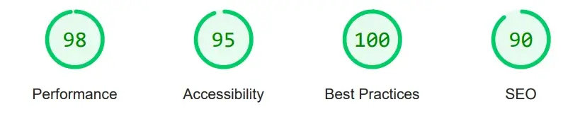
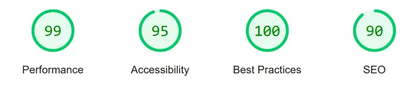

# Easy Rental -  Testing

Visit the deployed site: [Easy Rental](https://hourianouhkhanjar.github.io/easy-rental/)

- - -

## CONTENTS

* [AUTOMATED TESTING](#automated-testing)
  * [W3C Validator](#w3c-validator)
  * [JavaScript Validator](#javascript-validator)
  * [Lighthouse](#lighthouse)

- - -

## AUTOMATED TESTING

### W3C Validator

[W3C](https://validator.w3.org/) was used to validate the HTML and CSS of the website.

* [index.html]() - Passed.
* [booking-page.html]() - Passed.
* [contact-supplier-page.html]() - Passed.
* [response-page.html]() - Passed.

* [style.css]() - Passed, three warnings.

- - -

### JavaScript Validator

[jshint](https://jshint.com/) was used to validate the JavaScript.

* [main.js]() - Passed.
* [animate.js]() - Passed

- - -

### Lighthouse

I used Lighthouse within the Chrome Developer Tools to test the performance, accessibility, best practices and SEO of the website.

**Home page**

**Booking page**

**Contact supplier page**

**Response page**

